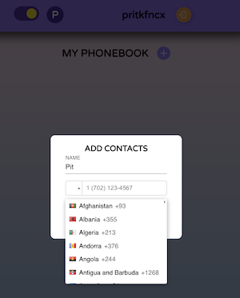
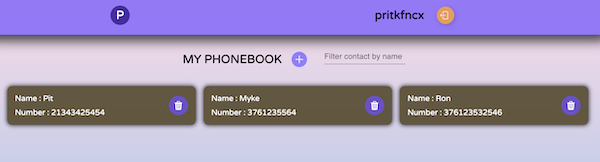

## REACT-TypeScript-PHONEBOOK _Vite_

### Phonebook app 📱

To create and save your contacts, you can also filter contacts by name and delete

# [OPEN APPLICATION](https://maxoverking.github.io/vite-react-ts/) HERE :eyes: !

## Application INTERFACE





## Quick Start 🖥️ 🚀

To get start application, follow these steps:

1. Clone this repository to your local machine.
2. Open the terminal and navigate to the project directory.
3. Run the following commands:

```
npm i
npm run dev
```

## Application architecture

- [main.tsx](src/main.tsx)
- [App.tsx](src/App.tsx)
- [Components](src/components)
  - [Register Form](src/components/RegisterForm/RegisterForm.tsx)
  - [Login Form](src/components/LoginForm/LoginForm.tsx)
  - [Contacts](src/components/Contacts/Contacts.tsx);
  - [pages](src/components/pages)
- [redux](src/redux);
  - [servises](src/redux/servises/servises.ts)
  - [authThunk](src/redux/auth/authOperation.ts);
  - [contactThunk](src/redux/contacts/contactOperation.ts);
- [types](src/types)

## Used Libraries and Technologies

- React
- React Hooks
- React Router
- Redux-Toolkit
- Redux Persist
- Styled Components
- Material-UI
- Axios
- Yup
- React Icons
- React Loader Spinner
- React Toastify
- nanoid
- Responsive design
- Use gh-pages and deploy
